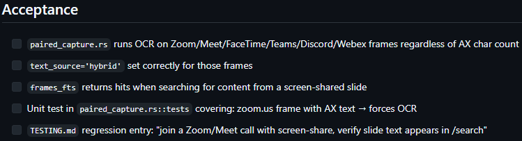
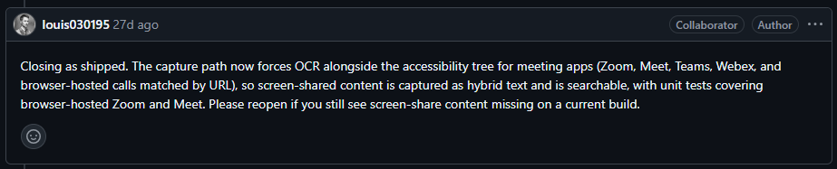

# Eixo C — Lacunas, Riscos e Falhas Potenciais

**Projeto analisado:** Screenpipe

**Repositório:** <https://github.com/screenpipe/screenpipe>

---

# Introdução

Nas Atividades 1 e 2 foram identificadas as funcionalidades centrais do Screenpipe, seus principais componentes arquiteturais e os riscos associados à evolução do projeto. A partir desses resultados, este eixo busca responder uma questão diferente: **o conjunto atual de testes é suficiente para proteger essas funcionalidades contra regressões?**

Mais do que verificar a existência de testes, esta análise procura identificar lacunas de cobertura, riscos decorrentes da ausência de validação automatizada e impactos que futuras alterações podem causar no comportamento do sistema.

Cada item foi elaborado seguindo o formato proposto pela atividade:

- **Evidência**
- **Diagnóstico**
- **Classificação de Risco**
- **Recomendação**

---

# 1. Funcionalidades Críticas sem Testes

## Evidência

Durante a Atividade 1 foi identificada como funcionalidade crítica do projeto a captura híbrida de informações por meio da Accessibility API e OCR.

A Issue **#3274** demonstra que um erro nesse mecanismo fazia com que conteúdos compartilhados durante reuniões em aplicações como Zoom, Google Meet, Microsoft Teams e Discord deixassem de ser registrados, embora o sistema aparentasse funcionar normalmente.

Na própria Issue, um dos critérios obrigatórios para aprovação da solução foi a criação de um teste unitário específico simulando o comportamento do Zoom, além da inclusão de um teste de regressão documentado em `TESTING.md`.

**Links:**

- <https://github.com/screenpipe/screenpipe/issues/3274>

---

## Diagnóstico

A exigência de novos testes apenas após a identificação da falha evidencia que esse cenário crítico não estava suficientemente protegido pela suíte existente.

Embora o projeto possua testes automatizados, a ocorrência desse defeito demonstra que situações envolvendo captura híbrida, OCR e Accessibility API ainda apresentam cobertura limitada, principalmente em ambientes reais de videoconferência.

Considerando que essa funcionalidade constitui o núcleo do Screenpipe, a ausência de testes preventivos representa uma fragilidade importante na estratégia de validação.

---

## Classificação de Risco

**Risco: ALTO**

A captura correta de informações representa a principal funcionalidade do sistema. Qualquer regressão nesse fluxo pode provocar perda silenciosa de dados, comprometendo buscas, resumos automáticos e funcionalidades baseadas em Inteligência Artificial.

---

## Recomendação

Expandir a suíte de testes para contemplar cenários envolvendo:

- Zoom;
- Google Meet;
- Microsoft Teams;
- Discord;
- Compartilhamento de tela;
- Captura híbrida (OCR + Accessibility API).

Além disso, recomenda-se manter testes de regressão permanentes para evitar que alterações futuras reintroduzam esse comportamento.

---

# 2. Módulos com Maior Risco de Alteração

## Evidência

Na Atividade 2 foram identificadas diversas ocorrências de **HACKs**, mecanismos de **retry** e comentários indicando limitações conhecidas em componentes responsáveis pela captura de tela.

Entre os exemplos encontrados destacam-se:

- inicialização do ScreenCaptureKit no macOS;
- mecanismos de retry durante captura;
- adaptações temporárias relacionadas à GPU e Metal;
- integrações específicas com bibliotecas externas.

Também foram identificadas dezenas de ocorrências da palavra-chave **HACK** distribuídas entre código, commits, Pull Requests e Issues.

**Print sugerido:**

- Trecho contendo o comentário *"necessary hack because this is unreliable"*.

---

## Diagnóstico

Os módulos responsáveis pela captura de tela e processamento de OCR apresentam elevado nível de complexidade técnica por dependerem diretamente de APIs do sistema operacional e bibliotecas externas.

Esses componentes concentram boa parte da dívida técnica identificada durante a auditoria arquitetural.

Alterações nesses módulos possuem maior probabilidade de introduzir regressões difíceis de reproduzir, principalmente devido às diferenças entre sistemas operacionais e ambientes de execução.

---

## Classificação de Risco

**Risco: ALTO**

São módulos altamente acoplados a tecnologias externas, cujo comportamento pode variar entre versões do sistema operacional ou bibliotecas utilizadas.

---

## Recomendação

Priorizar testes de integração e regressão para os módulos de:

- captura de tela;
- OCR;
- Accessibility API;
- sincronização de frames;
- processamento multimodal.

---

# 3. Dependências Externas sem Estratégia Completa de Isolamento

## Evidência

O Screenpipe depende diretamente de diversos serviços e tecnologias externas, incluindo:

- OpenAI;
- Anthropic;
- Ollama;
- SQLite;
- Accessibility API;
- ScreenCaptureKit;
- Apple Vision OCR;
- APIs específicas dos sistemas operacionais.

A arquitetura permite alternar entre diferentes provedores de IA, reduzindo parcialmente o acoplamento entre a lógica do sistema e os serviços utilizados.

**Print sugerido:**

- Arquivos de configuração dos Providers de IA.
- Documentação dos Pipes.

---

## Diagnóstico

Embora exista uma camada de abstração para diferentes provedores de Inteligência Artificial, muitas funcionalidades continuam dependendo diretamente de componentes externos cujo comportamento foge ao controle da equipe de desenvolvimento.

Caso APIs sofram alterações, indisponibilidade, mudanças de versão ou limitação de requisições, parte da suíte de testes poderá produzir resultados inconsistentes caso não utilize mecanismos adequados de isolamento.

Não foram encontradas evidências suficientes de utilização ampla de mocks ou stubs para todos esses componentes críticos.

---

## Classificação de Risco

**Risco: MÉDIO**

A arquitetura reduz parcialmente a dependência de fornecedores específicos, porém ainda existem riscos decorrentes da utilização de serviços externos e APIs nativas dos sistemas operacionais.

---

## Recomendação

Ampliar o uso de:

- Mocks;
- Stubs;
- Fixtures;
- Ambientes simulados;

para componentes responsáveis por IA, OCR, banco de dados e captura de tela.

Isso torna os testes mais previsíveis, rápidos e independentes do ambiente.

---

# 4. Proteção Contra Regressões

## Evidência

A Issue #3274 estabelece explicitamente como critério de aceite:

- criação de teste unitário;
- inclusão de teste de regressão em `TESTING.md`.

Essa preocupação demonstra que a equipe reconhece a importância de evitar que problemas semelhantes retornem em futuras alterações.

---

## Diagnóstico

O projeto demonstra preocupação com regressões em funcionalidades específicas.

Entretanto, não foram encontradas evidências de uma suíte ampla capaz de proteger todos os fluxos centrais do sistema, especialmente aqueles envolvendo integração entre OCR, captura de tela, banco de dados e provedores de IA.

Grande parte da estratégia atual parece concentrar-se na correção de problemas específicos à medida que são identificados pela comunidade.

---

## Classificação de Risco

**Risco: MÉDIO**

Existem mecanismos de prevenção contra regressões localizadas, porém ainda há oportunidades para ampliar a cobertura dos principais fluxos do sistema.

---

## Recomendação

Criar uma suíte contínua de testes de regressão executada automaticamente no pipeline de integração contínua, contemplando os principais cenários de uso do Screenpipe.

---

# 5. Capacidade da Suíte Atual em Detectar Bugs Críticos

## Evidência

As funcionalidades centrais do projeto dependem da interação simultânea entre:

- captura de tela;
- OCR;
- Accessibility API;
- banco SQLite;
- provedores de Inteligência Artificial;
- diferentes sistemas operacionais.

Essas integrações aumentam significativamente a complexidade dos cenários de teste.

---

## Diagnóstico

A suíte atual é capaz de identificar problemas localizados e validar comportamentos específicos.

Entretanto, considerando o elevado número de dependências externas e a complexidade do pipeline de captura multimodal, não há evidências suficientes de que um defeito crítico envolvendo múltiplos componentes seria identificado rapidamente apenas pelos testes existentes.

Bugs relacionados à integração entre OCR, IA e APIs do sistema operacional ainda dependem fortemente de validações em ambiente real.

---

## Classificação de Risco

**Risco: ALTO**

Falhas de integração podem permanecer ocultas por longos períodos e comprometer diretamente a principal funcionalidade do produto.

---

## Recomendação

Investir prioritariamente em:

- testes de integração;
- testes end-to-end;
- testes de regressão contínuos;
- execução automática desses testes em Pull Requests e Releases.

---

# Conclusão

A análise evidencia que o Screenpipe possui uma base sólida de testes e demonstra preocupação crescente com qualidade, especialmente em funcionalidades críticas identificadas pela comunidade.

Entretanto, a complexidade arquitetural do projeto, aliada à forte dependência de APIs externas, bibliotecas de captura e provedores de Inteligência Artificial, cria cenários que ainda não estão completamente protegidos pela suíte atual.

Os principais riscos concentram-se na captura híbrida de informações, nas integrações com componentes do sistema operacional e nas funcionalidades multimodais que constituem o núcleo do produto.

Como evolução natural da estratégia de testes, recomenda-se ampliar a cobertura de integração e regressão, fortalecer o isolamento de dependências externas por meio de mocks e ambientes simulados e consolidar testes automatizados para os fluxos mais críticos do sistema.

Essas melhorias aumentariam significativamente a capacidade do projeto de evoluir com segurança, reduzindo regressões e fortalecendo a confiabilidade do Screenpipe frente ao crescimento contínuo de sua arquitetura e de suas funcionalidades.
